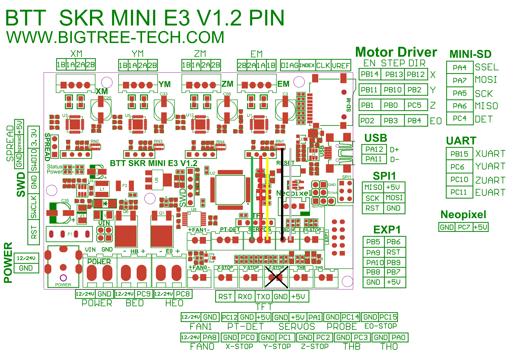
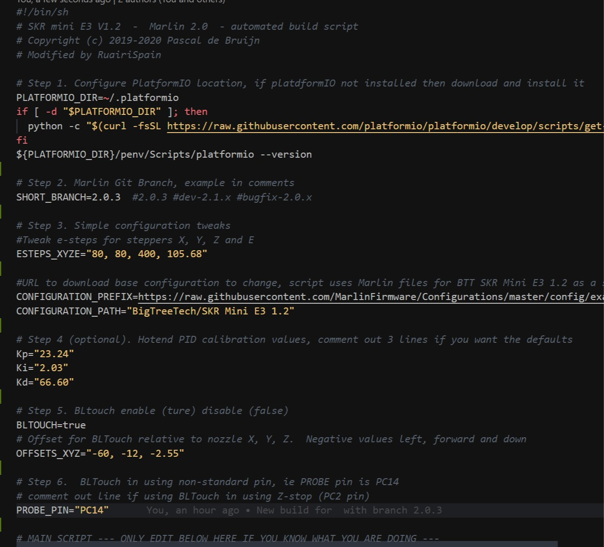

# Automated build script for Marlin on SKR mini E3 V1.2

Marlin binaries with BLTouch most settings are customizable from the LCD display, you can customize:
X, Y, Z Offsets; steps/mm; bed leveling; Probe Z offset; `M48` probe accuracy; Level corners (paper test); Preheat PLA/PTEG; Velocity; Acceleration; Jerk; TMC driver settings; BLTouch settings menu; K value; Runout sensor. These are enabled: Nozzle Park, Junction deviation, Linear Advance, Trinamic hybrid threshold, SCurve not enabled. You can print from SD card or via Cura/OctoPi/PronterFace.

You can enable/disable the BLTOuch by setting the variable `BLTOUCH=true or BLTOUCH=false`. I use a clone BLTouch called 3DTouch, it has a non-standard wire colours so I've added a diagram for anyone that needs it with my wiring colors. I connect my BLTouch to SKR board using `PROBE` and `SERVO` pins. You can set the PIN in the script, with `$PROBE_PIN`, or comment it out and it will be configured for the z-stop.   
You can customize the BLTouch offset by editing `OFFSETS_XYZ="-45, -5, -2"`. My BLTouch `XYZ` offsets are setup for the Hydra Fan system https://www.thingiverse.com/thing:4062242. You can change the offsets in the LCD menus when the firmware is flashed to the printer.

Before doing a big print, you should calibrate your step/mm and hot-end PID and change them in the menus. There are variable in the script to customize the PID, example: `Kp="23.24", Ki="2.03", Kd="66.60"`

This script is fork of [Pascal's project](https://github.com/pmjdebruijn/BIGTREETECH-SKR-mini-E3-V1.2)

# Dependencies:

Bash shell (Windows can use Git Bash command line)
Git
It downloads latest platformIO, if it's not installed

# Getting started (takes about 5-10 minutes to compile):

```
1. Edit skr_mini_e3_build.sh, check the commments.  There are step1 to 6 to follow.  Save changes.
2. In the Bash shell or unix command line run the script:
        ./skr_mini_e3_build.sh
3. Copy the firmware .bin to your SD card and reboot Ender 3, rename the file so it it called `firmware.bin`. Reflashing the firmware should take 30 seconds/1 minute.  Check the SD card, to make sure the firmware.bin is renamed to firmware.cur, if the bin file is still on the SD card then delete it, this will speed up boot time of Ender 3.
```

# Build Script Screenshot:


